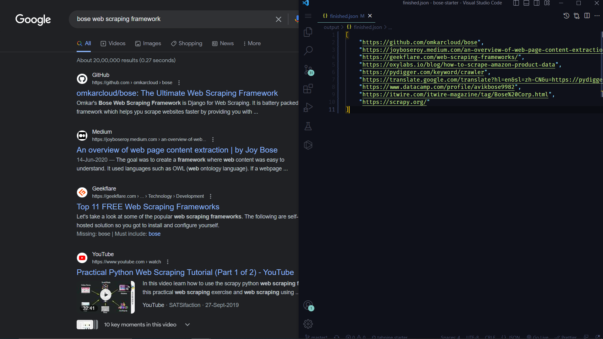

# Getting Started

:::info Prerequisites

- Bose requires [Python](https://www.python.org/) (>=3.x)

:::

Clone Starter Template

```bash
git clone https://github.com/omkarcloud/bose-starter my-bose-project
```

Then change into that directory, install dependencies, open vscode, and start the project:

```bash
cd my-bose-project
python -m pip install -r requirements.txt
code .
python main.py
```

The first run will take some time as it downloads the chrome driver executable, subsequent runs will be fast.

<!-- Once started it will scrape google search for "bose web scraping framework" keyword and store the results in /output/finished.json -->
Once started it will scrape data and store the results in /output/finished.json
<!--  -->

## Next Steps

The best way to learn Bose is by going through the comprehensive [tutorial](tutorial/tutorial.md).