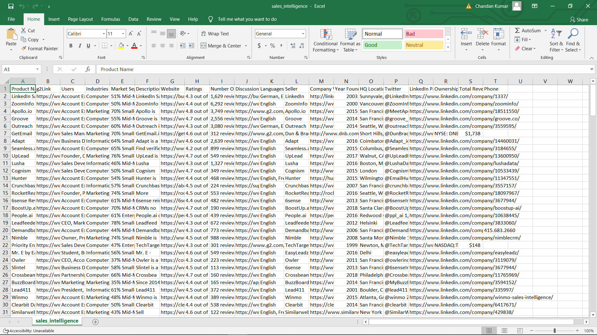

# G2 Scraper



This is a Python script that allows you to scrape product information from G2. The script first gets the product links and then scrape the products.

## Installation

1. Clone Starter Template
```
git clone https://github.com/omkarcloud/g2-scraper
cd g2-scraper
```
2. Install dependencies
```
python -m pip install -r requirements.txt
```

## Usage

- In `extract_product_links.py` specify your `Task.product_url`
- Run Project
```
python main.py
```
The script will start running and output progress updates to the console. When the scraper is complete, it will generate a JSON file named `pending.json` in the `output` directory. The JSON file will contain the product links.

Once the bot is detected by Cloudflare, the script will recognize it and prompt you to press the "Enter" key in the console once you have successfully solved the Cloudflare captcha.

Additionaly, you don't have to configure the Selenium driver as it will automatically download the appropriate driver based on your Chrome browser version.

- In `main.py` change `task` variable to `src.extract_product_links` 
- Rerun Project
```
python main.py
```
- The products will be extracted and stored in the output/finished.csv and output/finished.json file after scraping.


