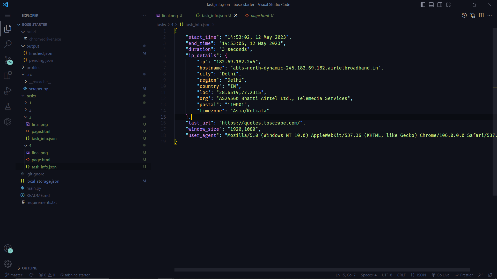
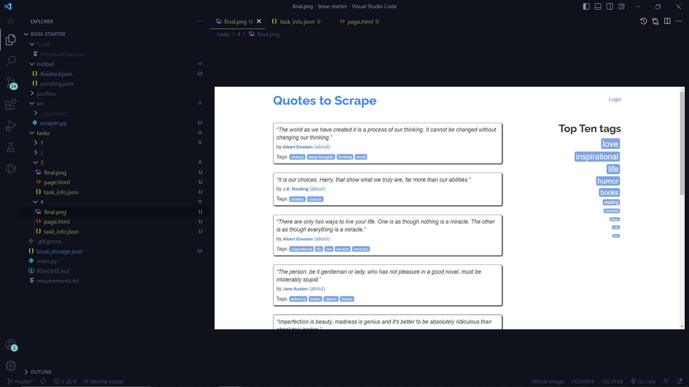
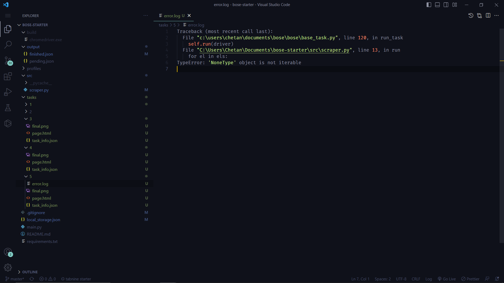

# Tutorial


> I am an IITian with a perfectionist attitude to work, open to projects. See my projects at [https://dev.to/chetanan/chetan-jains-portfolio-cl6](https://dev.to/chetanan/chetan-jains-portfolio-cl6) 

Bot Development is Tough. 

Bot Detectors like Cloudflare are ready to defend websites from our Bots. Configuring Selenium with ChromeOptions to specify the driver path, profile, user agent, and window size is Cumbersome and a nightmare in windows. Debugging Bot Crashes via logs is hard. How do you solve these pain points without sacrificing speed and handy development?

Enter Bose. Bose is the first bot development framework in the Developer Community that is specifically designed to provide the best developer experience for bot developers. Powered by Selenium, it offers a range of features and functionalities to simplify the process of bot development. As far as our knowledge goes, Bose is the first bot development framework of its kind in the town.

## Getting Started

Clone Starter Template

```
git clone https://github.com/omkarcloud/bose-starter my-bose-project
```

Then change into that directory, install dependencies, open vscode, and start the project:

```
cd my-bose-project
python -m pip install -r requirements.txt
code .
python main.py
```

The first run will take some time as it downloads the chrome driver executable, subsequent runs will be fast.


## Core features

1. Adds Powerful Methods to make working with Selenium a lot easier.
2. Follows best practices to avoid Bot Detection by Cloudflare and PerimeterX.
3. Saves the HTML, Screenshot, and the run details for each task run to enable easy debugging.
4. Utility components to write scraped data as JSON, CSV, and Excel files.
5. Automatically downloads and initializes the correct Chrome driver.
6. Fast and Developer friendly.

## Usage

Say you want to start scraping a website. If you were using bare Selenium, you would have to handle the imperative tasks of opening and closing the driver like this:

```python
from selenium import webdriver

driver_path = 'path/to/chromedriver'

driver = webdriver.Chrome(executable_path=driver_path)

driver.get('https://www.example.com')

driver.quit()
```

However, with Bose Framework, you can take a declarative and structured approach. You only need to write the following code, and Bose driver will take care of creating the driver, passing it to the **`run`** method of the Task, and closing the driver:

```python
from bose import *
        
class Task(BaseTask):
    def run(self, driver):
        driver.get('https://www.example.com')
```

## Configuration

In bare Selenium, if you want to configure options such as the profile, user agent, or window size, it requires writing a lot of code, as shown below:

```python
from selenium.webdriver.chrome.options import Options
from selenium import webdriver

driver_path = 'path/to/chromedriver.exe'

options = Options()

profile_path = '1'

options.add_argument(f'--user-data-dir={profile_path}')

user_agent = 'Mozilla/5.0 (X11; Linux x86_64) AppleWebKit/537.36 (KHTML, like Gecko) Chrome/106.0.0.0 Safari/537.37")'
options.add_argument(f'--user-agent={user_agent}')

window_width = 1200
window_height = 720
options.add_argument(f'--window-size={window_width},{window_height}')

driver = webdriver.Chrome(executable_path=driver_path, options=options)
```

On the other hand, Bose Framework simplifies these complexities by encapsulating the browser configuration within the **`BrowserConfig`** property of the Task, as shown below:

```python
from bose import BaseTask, BrowserConfig, UserAgent, WindowSize

class Task(BaseTask):
    browser_config = BrowserConfig(user_agent=UserAgent.user_agent_106, window_size=WindowSize.window_size_1280_720, profile=1)
```

## Exception handling

Exceptions are common when using Selenium. In bare Selenium, if an exception occurs, the driver automatically closes, leaving you with only logs to debug.

In Bose, when an exception occurs in a scraping task, the browser remains open instead of immediately closing. This allows you to see the live browser state at the moment the exception occurred, which greatly helps in debugging.


## Debugging

Web scraping can often be fraught with errors, such as incorrect selectors or pages that fail to load. When debugging with raw Selenium, you may have to sift through logs to identify the issue. Fortunately, Bose makes it simple for you to debug by storing information about each run.

After each run a directory is created in tasks which contains three files, which are listed below:

### `task_info.json`
It contains information about the task run such as duration for which the task run, the ip details of task, the user agent, window_size and profile which used to execute the task. 



### `final.png`
This is the screenshot captured before driver was closed. 




### `page.html`
This is the html source captured before driver was closed. Very useful to know in case your selectors failed to select elements.


### `error.log`
In case your task crashed due to exception we also store error.log which contains the error due to which the task crashed. This is very helful in debugging.



## Outputting Data

After performing web scraping, we need to store the data in either JSON or CSV format. Typically, this process involves writing a significant amount of imperative code which looks like this:

```python
import csv
import json

def write_json(data, filename):
    with open(filename, 'w') as fp:
        json.dump(data, fp, indent=4)

def write_csv(data, filename):
    with open(filename, 'w', newline='', encoding='utf-8') as csvfile:
        fieldnames = data[0].keys()  # get the fieldnames from the first dictionary
        writer = csv.DictWriter(csvfile, fieldnames=fieldnames)
        writer.writeheader()  # write the header row
        writer.writerows(data)  # write each row of data

data = [
    {
        "text": "\u201cThe world as we have created it is a process of our thinking. It cannot be changed without changing our thinking.\u201d",
        "author": "Albert Einstein"
    },
    {
        "text": "\u201cIt is our choices, Harry, that show what we truly are, far more than our abilities.\u201d",
        "author": "J.K. Rowling"
    }
]

write_json(data, "data.json")
write_csv(data, "data.csv")
```

Bose simplifies these complexities by encapsulating them in Output Module for reading and writing Data. 

To use Output Method, call the `write` method for the type of file you want to save.

All data will be saved in the `output/` folder:

See following Code for Reference

```python
from bose import Output

data = [
    {
        "text": "\u201cThe world as we have created it is a process of our thinking. It cannot be changed without changing our thinking.\u201d",
        "author": "Albert Einstein"
    },
    {
        "text": "\u201cIt is our choices, Harry, that show what we truly are, far more than our abilities.\u201d",
        "author": "J.K. Rowling"
    }
]

Output.write_json(data, "data.json")
Output.write_csv(data, "data.csv")
```

## Undetected Driver

[Ultrafunkamsterdam](https://github.com/ultrafunkamsterdam) created a [ChromeDriver](https://github.com/ultrafunkamsterdam/undetected-chromedriver) that has excellent support for bypassing **all major bot detection systems** such as Distil, Datadome, Cloudflare, and others. 

Bose recognized the importance of bypassing bot detections and provides in built support for [Ultrafunkamsterdam’s](https://github.com/ultrafunkamsterdam) [Undetected Driver](https://github.com/ultrafunkamsterdam/undetected-chromedriver) 

Using the Undetected Driver in Bose Framework is as simple as passing the **`use_undetected_driver`** option to the **`BrowserConfig`**, like so:

```python
from bose import BaseTask, BrowserConfig

class Task(BaseTask):
    browser_config = BrowserConfig(use_undetected_driver=True)
```

## LocalStorage

Just like how modern browsers have a local storage module, Bose has also incorporated the same concept in its framework.

You can import the LocalStorage object from Bose to persist data across browser runs, which is extremely useful when scraping large amounts of data.

The data is stored in a file named `local_storage.json` in the root directory of your project. Here's how you can use it:

```python
from bose import LocalStorage

LocalStorage.set_item("pages", 5)
print(LocalStorage.get_item("pages"))
```

## Boss Driver

The driver you receive in the **`run`** method of the Task is an extended version of Selenium that adds powerful methods to make working with Selenium much easier. Some of the popular methods added to the Selenium driver by Bose Framework are:

| METHOD | DESCRIPTION |
| --- | --- |
| get_by_current_page_referrer(link, wait=None) | simulate a visit that appears as if you arrived at the page by clicking a link. This approach creates a more natural and less detectable browsing behavior. |
| js_click(element) | enables you to click on an element using JavaScript, bypassing any interceptions(ElementClickInterceptedException) from pop-ups or alerts |
| get_cookies_and_local_storage_dict() | returns a dictionary containing "cookies" and "local_storage” |
| add_cookies_and_local_storage_dict(self, site_data) | adds both cookies and local storage data to the current web site |
| organic_get(link, wait=None) | visits google and then visits the “link” making it less detectable |
| local_storage | returns an instance of the LocalStorage module for interacting with the browser's local storage in an easy to use manner |
| save_screenshot(filename=None) | save a screenshot of the current web page to a file in tasks/ directory |
| short_random_sleep() and long_random_sleep(): | sleep for a random amount of time, either between 2 and 4 seconds (short) or between 6 and 9 seconds (long) |
| get_element_or_* [eg: get_element_or_none, get_element_or_none_by_selector, get_element_by_id, get_element_or_none_by_text_contains,] | find web elements on the page based on different criteria. They return the web element if it exists, or None if it doesn't. |
| is_in_page(target, wait=None, raise_exception=False) | checks if the browser is in the specified page |

Bose is an excellent framework that simplifies the boring parts of Selenium and web scraping.

Wish you best of Luck and Happy Bot Development with Bose Framework!

---

### If Bose Framework helped in Bot Development, please take a moment to [star the repository](https://github.com/omkarcloud/bose). Your act of starring will help developers in discovering our Repository and contribute towards helping fellow developers in Bot Development. Dhanyawad 🙏! Vande Mataram!

